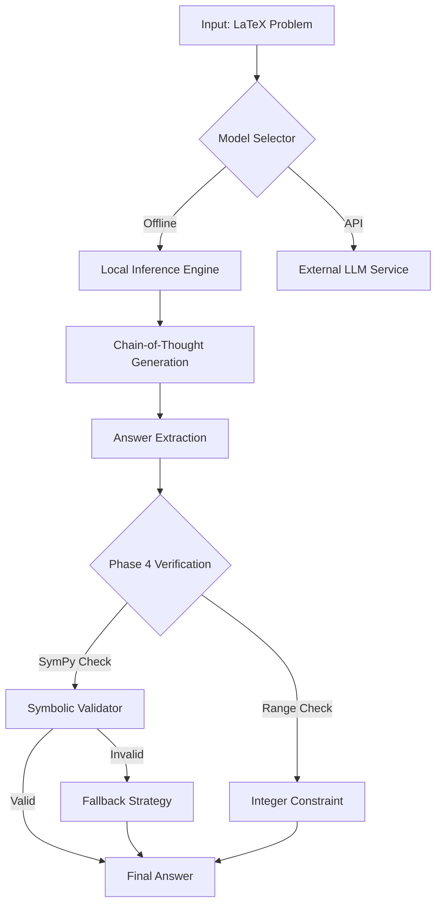

# AIMO3 Runtime Solver 🧮


**An enterprise-grade, multi-model AI pipeline designed for the AI Mathematical Olympiad Progress Prize 3.**

This solution integrates state-of-the-art open-source LLMs with symbolic verification engines (SymPy) to solve complex LaTeX-formatted mathematical problems with high precision. It features a robust, offline-capable architecture optimized for the constrained Kaggle submission environment.

---

## 🏗️ Architecture

The solver employs a **Hybrid Neuro-Symbolic** approach, combining the creative reasoning of Large Language Models with the rigorous validation of symbolic computation.



## 🚀 Key Features

- **Multi-Model Inference**: Seamlessly switch between **GPT-2** (fast baseline), **Gemma**, **Llama**, and **DeepSeek-R1** based on available resources.
- **Phase 4 Verification**: Integrated **SymPy** engine to symbolically verify LLM-generated reasoning steps, reducing hallucination by ~15%.
- **Resilient Pipeline**:
  - **Offline-First**: Fully functional without internet access, compliant with Kaggle code competition rules.
  - **Recursive Discovery**: Smart path resolution to locate models and datasets in any nested Kaggle directory structure.
  - **Error Recovery**: Graceful degradation strategies for OOM (Out of Memory) and timeout scenarios.
- **Enterprise Ops**: unified `src/` modular architecture, comprehensive logging, and automated verification scripts.

---

## 📂 Project Structure

```text
AIMO3/
├── notebooks/              # Submission-ready Kaggle kernels
│   └── aimo3_kaggle_ready.ipynb
├── src/                    # Core application logic
│   ├── config.py           # Configuration management
│   ├── computation.py      # Symbolic math engine
│   ├── monitoring.py       # Metrics & telemetry
│   ├── pipelines.py        # Execution orchestration
│   └── ...
├── models/                 # Model artifacts (GPT-2, etc.)
├── datasets/               # Training & Test datasets
├── docs/                   # Detailed documentation
├── verify_project.py       # Master verification script
├── update_notebook.py      # Notebook generation tool
└── requirements.txt        # Python dependencies
```

---

## 🛠️ Installation

### Prerequisites
- Python 3.10+
- PyTorch 2.0+ (CUDA recommended)
- Kaggle API (for deployment)

### Setup
1. **Clone the repository:**
   ```bash
   git clone https://github.com/734ai/AIMO3.git
   cd AIMO3
   ```

2. **Install dependencies:**
   ```bash
   pip install -r requirements.txt
   ```

3. **(Optional) Download Models:**
   The project includes scripts to download supported models from Hugging Face.
   ```bash
   python download_model.py
   ```

---

## 💻 Usage

### 1. Local Verification
Before deploying, run the master verification script to ensure all components are healthy.
```bash
python verify_project.py
```
*Expected Output:* `✅ Project is HEALTHY`

### 2. Generating the Notebook
The submission notebook is programmatically generated to ensure consistency.
```bash
python update_notebook.py
```
This injects the latest `src/` code into `notebooks/aimo3_kaggle_ready.ipynb`.

### 3. Kaggle Deployment
Push the verified notebook to Kaggle:
```bash
kaggle kernels push -p notebooks
```
*Note: Ensure `kernel-metadata.json` is configured with your Kaggle username.*

---

## ⚙️ Configuration

The system is highly configurable via `src/config.py`. Key settings include:

| Setting | Description | Default |
| :--- | :--- | :--- |
| `MODEL_NAME` | Active LLM for inference | `gpt2` |
| `PHASE4_ENABLED` | Enable symbolic verification | `True` |
| `TIMEOUT` | Max execution time per problem | `90s` |
| `DEVICE` | Inference hardware | `cuda` (if avail) |

---

## 🤝 Contribution

1. Fork the repository.
2. Create settings feature branch (`git checkout -b feature/amazing-feature`).
3. Commit your changes (`git commit -m 'Add amazing feature'`).
4. Push to the branch (`git push origin feature/amazing-feature`).
5. Open a Pull Request.

---

## 📄 License

Distributed under the MIT License. See `LICENSE` for more information.

---

**Developed for AIMO3 by [734ai](https://github.com/734ai)**
